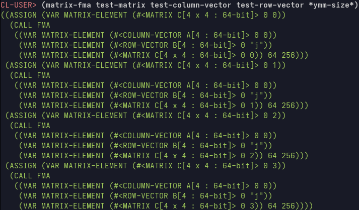

## README ##

Gemmini is an early stage, experimental approach to the implementation
of the level-3 BLAS.  Gemmini aims to instantiate a version of the
level-3 BLAS operations, specialised to a system's specific
architecture. It does this by generating code automatically from a
high-level abstract representation of each BLAS operation.

Gemmini is a hobby project, made purely out of enjoyment. This readme
is also intended for people who may have some curiosity about the
project, rather than using it for serious HPC work, at least at the
current very early stage.

In this current early state, Gemmini only supports the microkernels of
GEMM operations (hence the name), and only targets CPUs, using C. This
requires a CPU which supports AVX2 instructions. AVX-512 is supported,
but may have bugs which I haven't spotted yet, due to focusing on
AVX2.

Gemmini uses Lisp to automate code generation, and uses ASDF to
compile the `.lisp` files. SBCL or some alternative Common Lisp
implementation will be needed for this.

The boilerplate C code which remains is compiled with Meson. Over
time, the parts which have more variability in their implementation
may be auto-generated by the Lisp sections.

# General description and use #

Gemmini works by first constructing an abstract intermediate
representation of a given operation, which roughly resembles how you
might describe the procedure at a high-level to a person. Then the
intermediate representation is mapped to a target language and
architecture (e.g. an implementation of GEMM in C for a CPU with
256-bit YMM registers). The abstraction of the operation itself away
from any particular representation in a given language is intended to
allow easy extension to different architectures, or different
languages, and handle different float precisions easily, as well as
making extension to new operations easier in principle.

In order to construct code for a target architecture, we build an
abstract syntax tree (AST) for that particular BLAS operation on that
target architecture. Here is a visual example of applying vector FMAs
to perform a rank-1 update of a matrix of doubles might look:

<p align="center">
  
  <br>
  <em>Figure 1: This is an example showing how part of an AST would look for a CPU implementation of a 4 x 4 `dgemm` microkernel. This can later get translated into AVX2 intrinsics.</em>
</p>

Currently, the user can invoke the code generation process by calling
a simple Bash script in the `generators` directory: `build.sh`. This
should be given the name of a BLAS operation, the dimensions of the
microkernel, the precision of the operation, in bits, and the size of
the vector registers of the CPU, also in bits, e.g. (in the
`/generators` directory)

```bash
sh ./build.sh gemm 4 4 64 256
```

will generate a 4 x 4 `dgemm` microkernel, targeting 256-bit vector
registers. This will use AVX2 intrinsics. AVX-512 support is
tentatively possible by specifying a 512-bit vector register, assuming
the CPU actually supports AVX-512, but bugs may exist. Changing the
precision to 32 in the above example, instead of 64, will generate an
`sgemm` microkernel instead.

If you want to change microkernel dimensions, just run the build
script again, and the microkernel will be overwritten with a new one.

After a microkernel has been generated, the rest of the code can be
compiled with Meson by 

```shell 
meson setup builddir/
```

and then

```shell
ninja -C builddir/
```

It is possible to change the parameters of the loops around the
microkernel by passing them as flags, but please remember to generate
a microkernel which matches the parameters `MR` and `NR`. At this
stage, the code generator does not automatically overwrite the
parameters in `meson_options`.

It may also be necessary to adjust the number of cores of the CPU
being used by OpenMP. The number of cores will be reported back to you
by the script `generators/get_build_params`. See the section on cache
parameters for more.

So far, only the `gemm` microkernels are supported, with plans for
expansion to both other traditional level-3 BLAS operations, and
alternative variants of the standard BLAS operations.

An implementation of the loops around the microkernel is also provided
for `dgemm` and `sgemm`, minus some optimisations, such as
prefetching. This means that the optimal microkernel parameters will
not be exactly as suggested in the literature, which assumes
prefetching is implemented. More on this in the [cache parameter
section](#Cache-section).

Currently, Gemmini assumes that the row micropanel will be used for
broadcasting, and not the column micropanel. This means that the
number of rows in the microkernel is required to be a multiple of 4.

# Performance #

Testing so far shows similar performance to BLIS when good parameters
are chosen. So far, cache parameters are not automatically fully
optimised to the architecture (you can read more about this in the
next section). This is because the majority of the high performance
comes from a good choice of microkernel dimensions and cache
parameters, even though so far certain optimisations such as inlined
assembly and prefetching remain unimplemented. Performance will
usually hit around 90% of BLIS performance, or greater. It is also
possible to play with parameters to get much closer to parity with
BLIS than this.

Currently, you can test the performance of a particular `gemm` (either
`sgemm` or `dgemm`) implementation in two ways. You can either test it
on its own and record its performance in gigaflops per second (GFLOPS)
with `Xgemm_solo_test` (where `Xgemm` can be either `sgemm` or
`dgemm`), or you can compare it to a reference (BLIS) implementation.

This is mostly for development purposes, but is still included for
documentation purposes.

To benchmark with `Xgemm_solo_test`, the syntax is

```shell
./path/to/Xgemm_solo_test TransA TransB start stop step repetitions
```

where `TransA` and `TransB` can be either `T`, `Trans`, or `N`,
`NoTrans`, indicating transposition, or no transposition, respectively
(actually anything that starts with T or N will work for now), and the
other arguments should be positive integers. The performance is
measured by running the `gemm` implementation `repetitions` times and
recording the maximum GFLOPS attained, over randomised square matrices
with number of columns `start` to `stop` in steps `step`.

Here's an example:

```shell
./builddir/src/dgemm_solo_test Trans NoTrans 480 4800 48 3
```

will benchmark the `dgemm` variant `C += A^T B`, starting by letting
`A` and `B` be random 480 x 480 matrices, recording the maximum
performance over 3 iterations, then taking `A` and `B` to be random
528 x 528 matrices, and so on, until finally testing random 4800 x
4800 matrices.

An easier visual option is to benchmark with the Python script
`tests/solo_bench.py`. This assumes that the location of the
executable `Xgemm_solo_test` is `builddir`, and will generate a plot
showing performance as a function of size.

# <a id="Cache-section"></a>Cache parameter notes #

Some good choices of cache parameters can be suggested by running the
Python script `get_cache_params.py`. This suggests cache parameters
based on [Low, et al.](https://dl.acm.org/doi/10.1145/2925987), using
some information about hardware data from [Agner Fog's
tables](https://www.agner.org/optimize/instruction_tables.pdf). This
script does not contain an exhaustive list of CPUs which are supported
in principle. If you find your CPU does support AVX2, but is not
supported yet, then it may be added in the future, and probably is
only missing because I preferred to implement other features
first. This will also not stop you actually running Gemmini, since the
suggested cache parameters are only suggestions, and not requirements.

So far, this only suggests compile-time constants which are strictly
relevant to the microkernel: the dimensions of the microkernel (`MR`
and `NR`), and the number of updates performed on the microtile
(`PC`). The first two can be passed as the first two arguments to
`build.sh`. The latter can be adjusted in the meson build file, or
passed as a compile-time constant in whatever other way you prefer.

Similarly, you may find that the suggested build parameters are nearly
but not exactly optimal. For a trivial example, when testing `dgemm`
on the Ryzen 5 5600X, I found that an 8 x 6 microkernel works well,
even though the usual algorithm suggests 8 x 4.

This is most likely because pre-fetching is not currently implemented,
so 15 of the 16 vector registers being used in an 8 x 6 microkernel
allows for more useful work to be done, whereas 8 x 4 microkernels use
only 11 of 16. Without prefetching, the latter will be less
effective. Prefetching will be implemented in a future update.

You are free to try any legal parameters out and completely ignore
these suggestions, and may even find better performance. This is
likely due to the current build not meeting all of the assumptions
made in the paper mentioned earlier, because some features are not
implemented yet.

# Other notes #

A sincere thank you to the University of Texas at Austin team for
their time and effort making great BLAS-related educational resources
freely available. 
